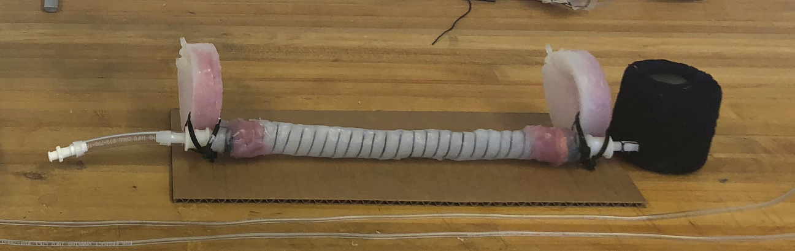
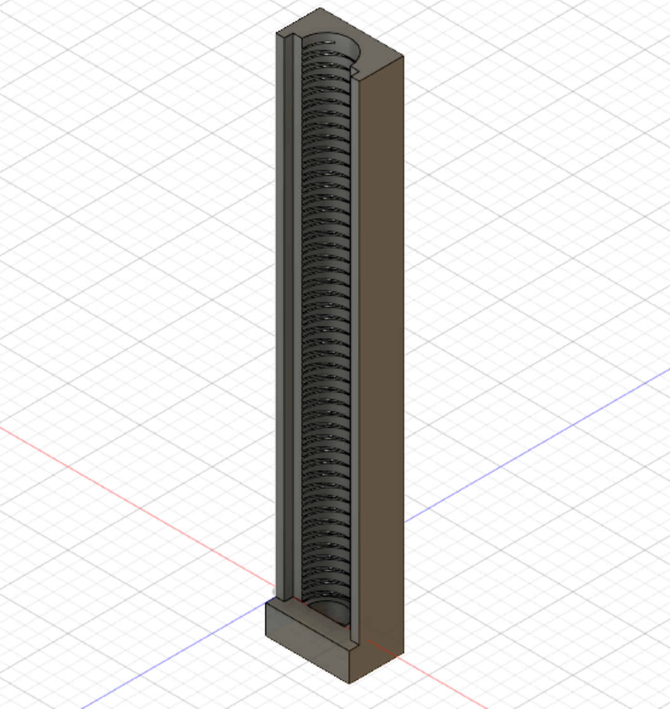
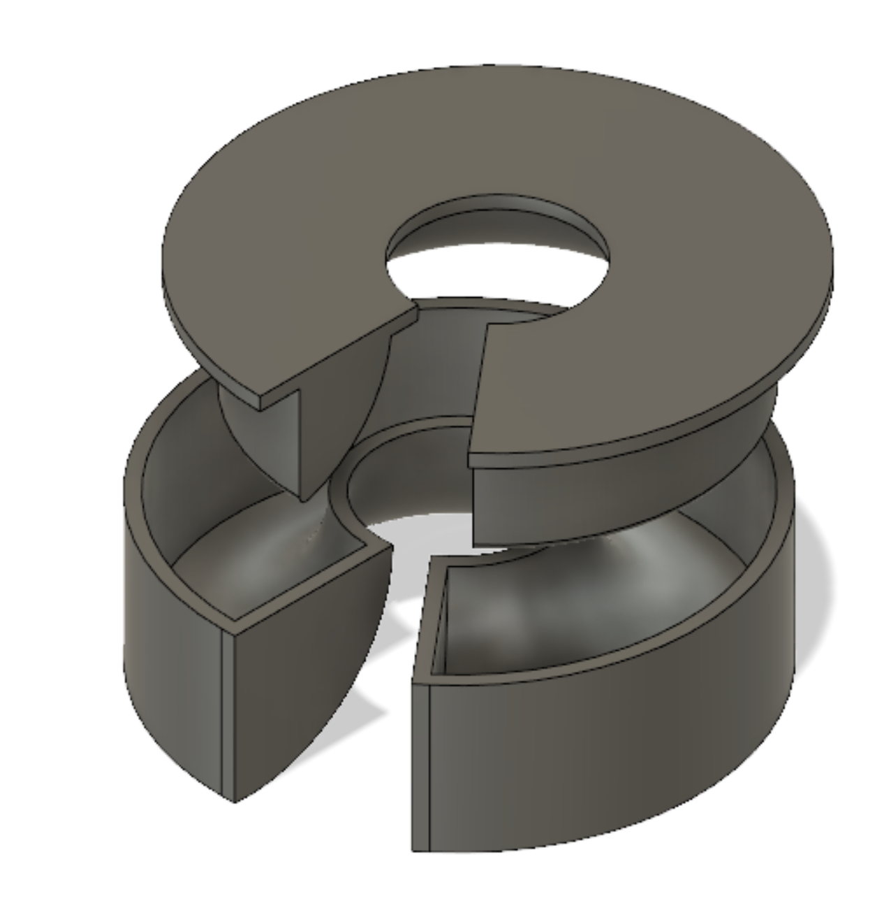
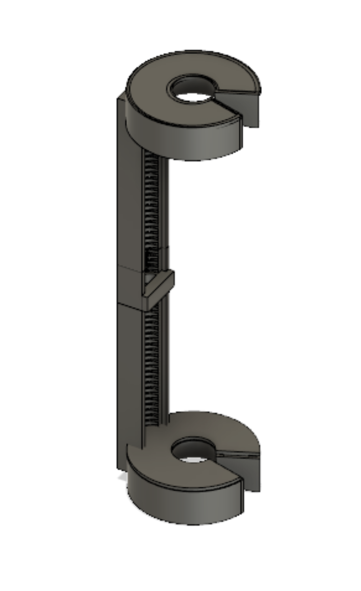
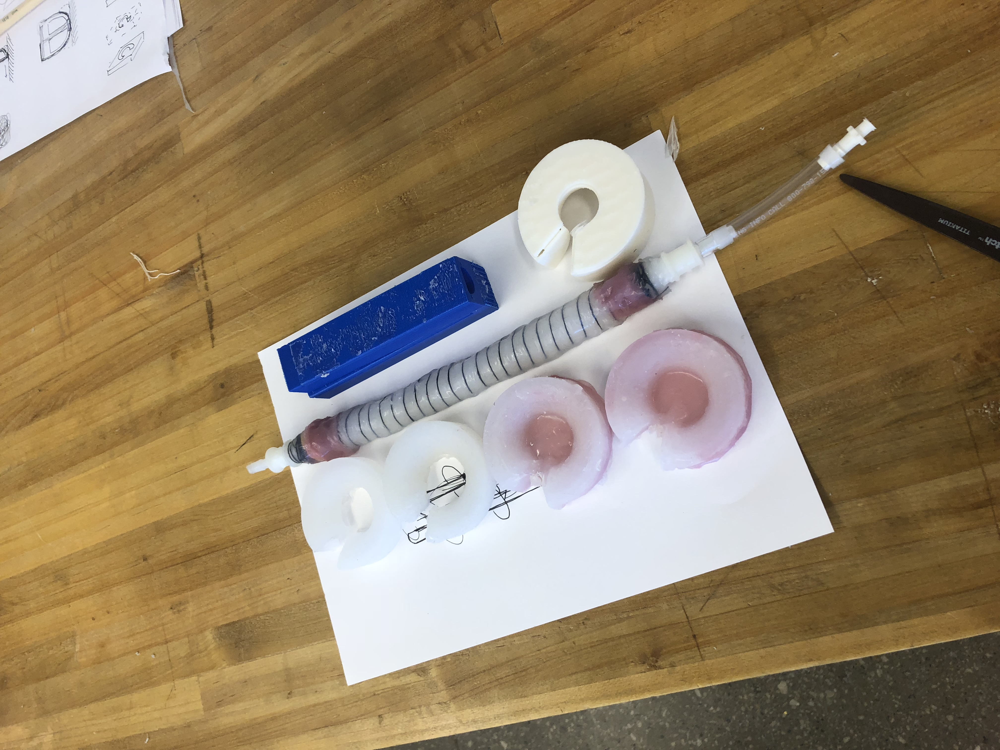
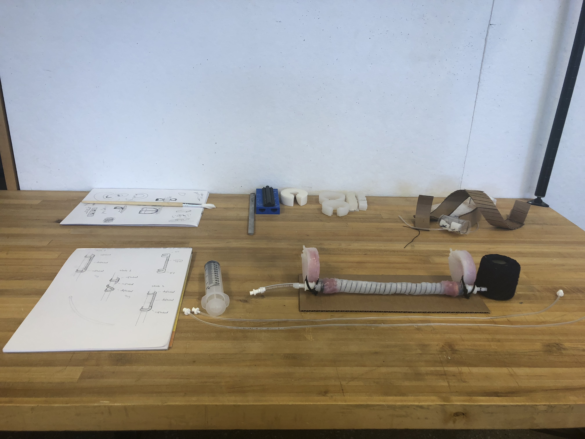
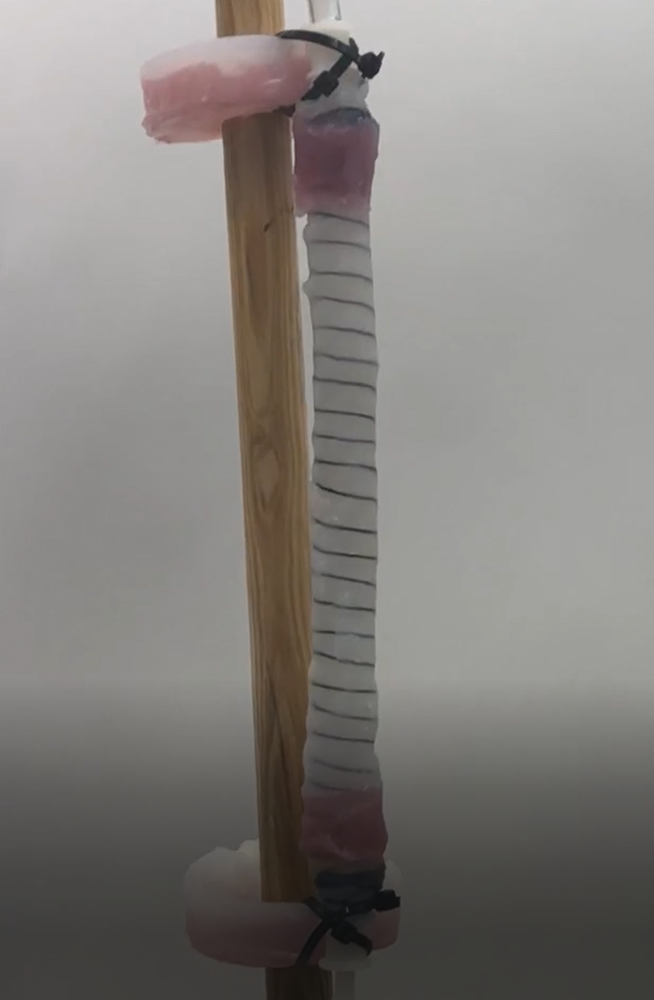
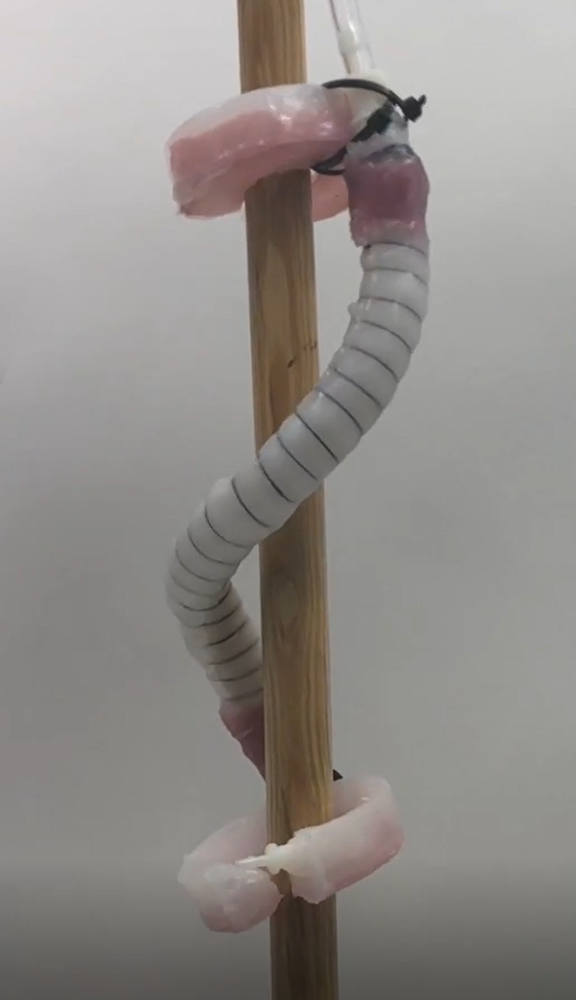
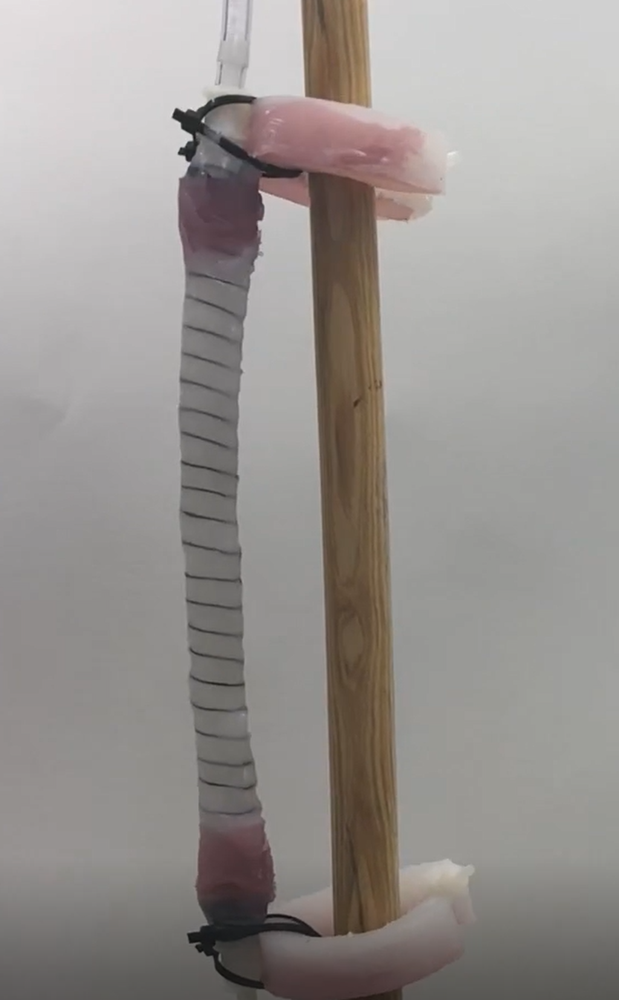

# SSR: Soft Stitching Robot
### 🚀 MIT NuVu Summer Camp 2018 — Soft Robotics Studio

---

## 📌 Project Overview

The **Soft Stitching Robot** is soft robotics project designed at the MIT NuVu summer program in 2018. The project explores the intersection of soft material engineering, Computer-Aided Design (CAD), and biological actuation to solve a critical challenge in minimally invasive medical procedures: **surgical suturing inside the body.**

Traditional surgical stitching requires rigid, sharp metallic needles and manual operation, which introduces human error and the risk of puncturing delicate internal tissues. The **SSR** utilizes a highly compliant, pneumatically actuated silicone body to perform safe, automated, and flexible suturing without the need for rigid components.



---

## 💡 The Problem & The Soft Robotics Solution

### The Challenge of Traditional Suturing
1. **Human Error:** Hand-guided stitching in tight internal cavities or under high-stress conditions is prone to surgeon error.
2. **Tissue Damage:** Rigid, sharp metal suture needles and surgical instruments can tear or puncture delicate internal organs during operation.

### Why a Soft Robot?
* **Compliance & Safety:** Made of soft silicone elastomer (like Ecoflex), the robot is inherently compliant. When inflating, it adapts to the surrounding biological environment, reducing contact force and eliminating the risk of accidental puncture wounds.
* **Automated Motion:** By controlling the pneumatic inflation of individual chambers in a pre-programmed sequence, the robot can generate precise, repeatable bending and suturing trajectories.

---

## 🛠️ CAD Modeling & Iterative Design

The fabrication of a soft robot begins with detailed mold design.

| The Robot Spine | The Robot Grip | The Full Mold |
| :---: | :---: | :---: |
|  |  |  |

---

## 🔬 Fabrication & Casting Workflow

The physical soft robot was fabricated using a two-stage silicone casting process:

1. **Elastomer Preparation:** Part A and Part B of a high-compliance silicone elastomer (e.g., Smooth-On Ecoflex) were mixed, degassed in a vacuum chamber, and poured into 3D-printed PLA/ABS molds.
2. **Chamber Casting (The Body):** The main actuator molds were used to cast a body containing hollow, semi-circular air chambers.
3. **Sealing (The Skin):** A secondary casting stage applied a thin outer silicone skin. A strain-limiting layer (such as fabric or paper) was embedded on the bottom face to restrict extension on one side, which forces the actuator to curl/bend when pressurized.

| Parts Before Assembly | Fully Assembled Soft Robot |
| :---: | :---: |
|  |  |

---

## 🎮 Actuation & Control States

To perform a suturing/stitching cycle, the SSR relies on a sequential pneumatic inflation mechanism. By inflating and deflating different internal chambers, the robot moves through three distinct **states** that guide the stitching thread in a circular motion:


### Inflation Sequence Details
The robot's pneumatic chambers are toggled in a precise pattern to generate forward crawling and circular suturing:
* **State 1 (Deflated/Anchored):** Chambers are deflated to return the robot to its baseline state or lock it into an anchor position.
* **State 2 (Bending/Advancing):** Alternate chambers are inflated. The strain-limiting layer forces the actuator to bend in a specific direction, pushing the suture thread through the tissue.
* **State 3 (Full Curvature):** Multiple chambers are inflated simultaneously to complete the stitching loop and pull the thread tight.

| State 1 (Idle) | State 2 (Bending) | State 3 (Stitching) |
| :---: | :---: | :---: |
|  |  |  |

> [!NOTE]
> For a full breakdown of the state logic and pneumatic control schema, see the [State Diagram](media/operation/state_diagram.jpg).

---

## 📁 Repository Structure

The SSR project files are organized to make it easy to browse, print, or modify:

```
/ (Root)
│   .gitignore             - Ignores OS, Python temp files, and local executables
│   README.md              - This documentation file
│
├───cad                    - Computer-Aided Design files
│   ├───stl                - 3D-printable STL files for rapid prototyping
│   └───solidworks         - SolidWorks CAD source files
│       ├───body           - SolidWorks files for the actuator body molds
│       └───skin           - SolidWorks files for the outer skin molds
│
├───documentation          - Presentations and portfolio slides
│   │   SSR.pptx           - The final project presentation PowerPoint
│   └───slides             - Exported presentation slides (PNG) for quick browser viewing
│
└───media                  - Documentation assets
    ├───fabrication        - Photos showing elastomer prep, mixing, and demolding
    ├───renders            - Renders and photos from Fusion 360 & SolidWorks
    └───operation          - Inflation state photos and diagrams
```
